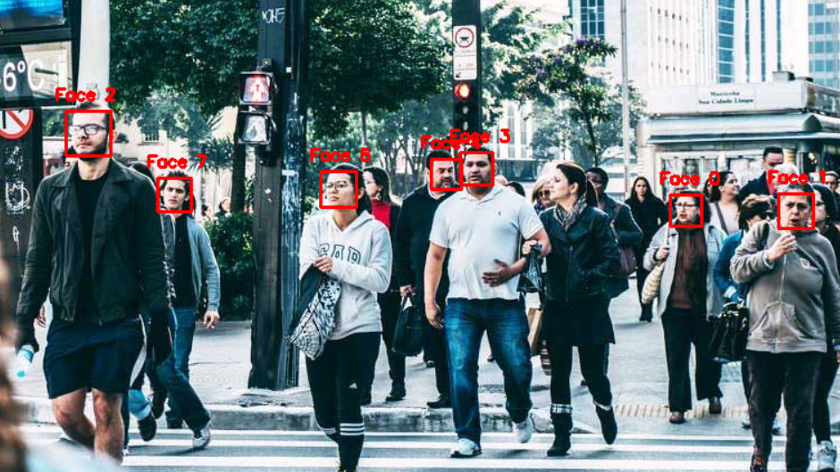
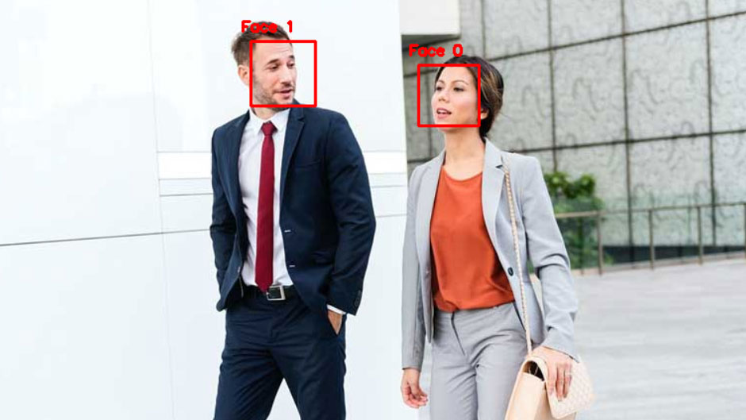
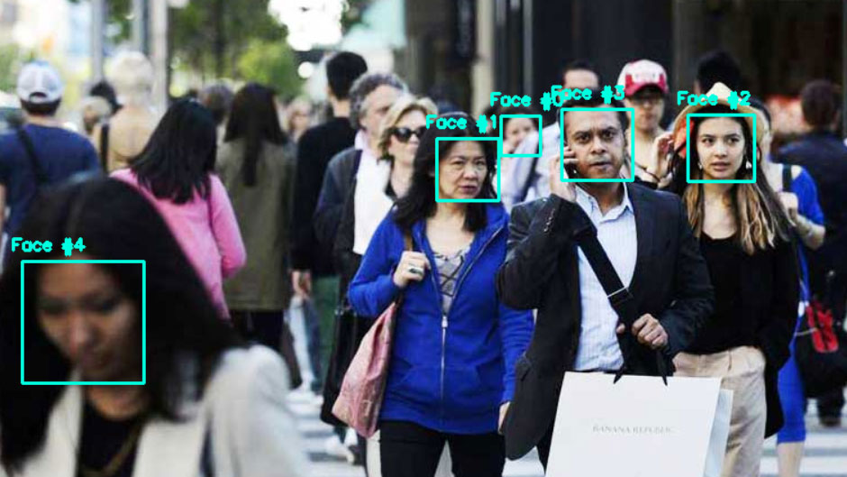
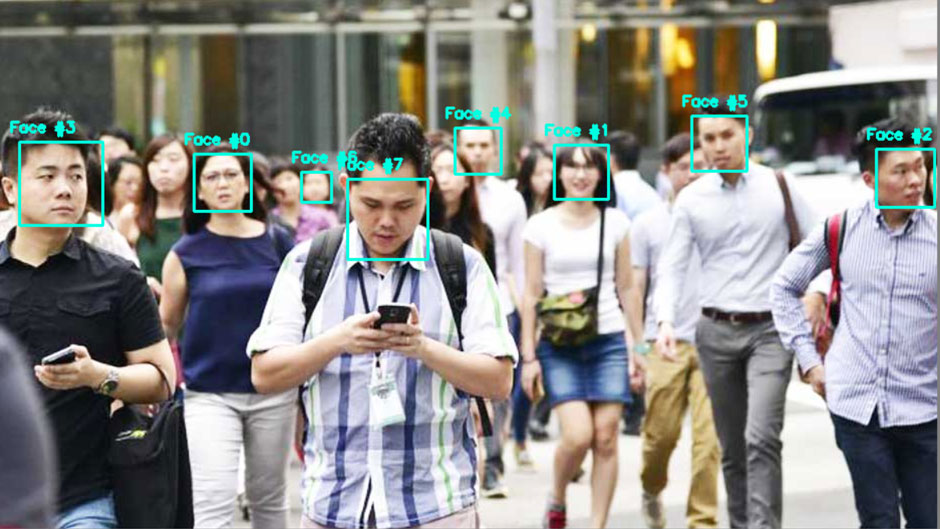
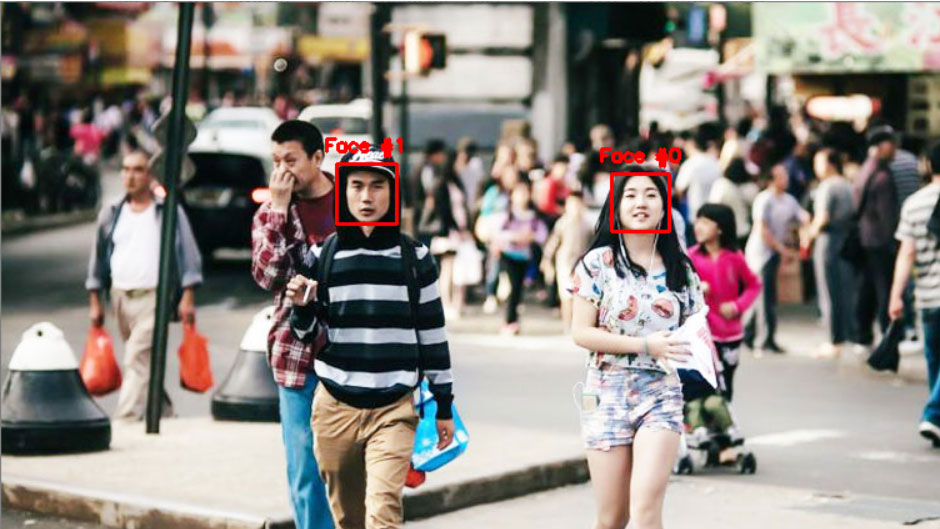
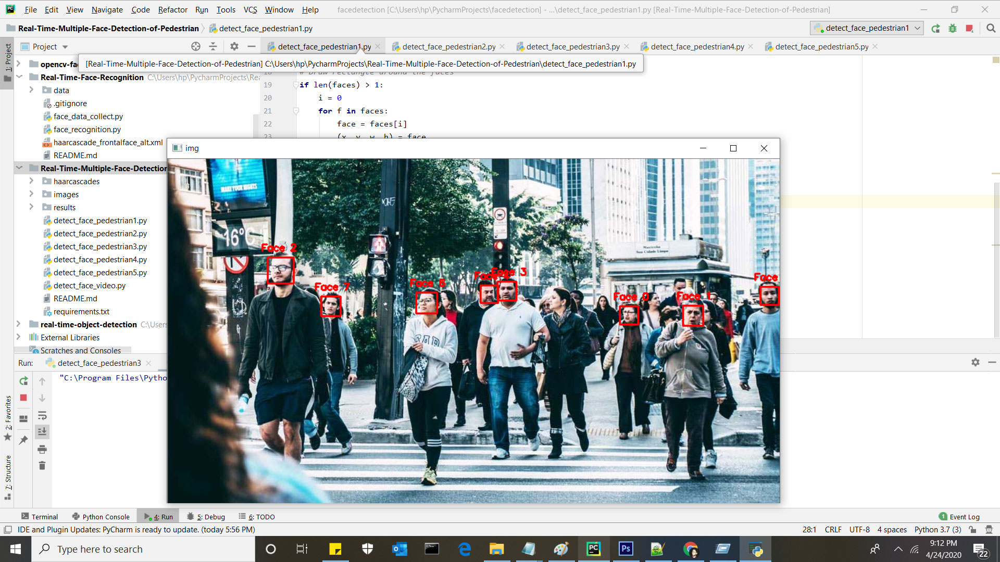

# Real Time Multiple Face Detection of Pedestrian

Object Detection using Haar feature-based cascade classifiers is an effective object detection method proposed by Paul Viola and Michael Jones in their paper, “Rapid Object Detection using a Boosted Cascade of Simple Features” in 2001. It is a machine learning based approach where a cascade function is trained from a lot of positive and negative images. It is then used to detect objects in other images.

## Real time face detection can be use via command prompt or GUI.

<table>
  <tbody>
	<tr align="center"> 
		<th><strong>A Real Time Face Detect Pedestrian 1</strong></th>
	</tr>
	<tr align="center">
		<td></td>		
	</tr>
	<tr align="center">
		<th><strong>A Real Time Face Detect Pedestrian 2</strong></th>
	</tr>
	<tr align="center">
		<td></td>
	</tr>
	<tr align="center">
		<th><strong>A Real Time Face Detect Pedestrian 3</strong></th>
	</tr>
	<tr align="center">
		<td></td>
	</tr>
	<tr align="center">
		<th><strong>A Real Time Face Detect Pedestrian 4</strong></th>
	</tr>
	<tr align="center">
		<td></td>
	</tr>
	<tr align="center">
		<th><strong>A Real Time Face Detect Pedestrian 5</strong></th>
	</tr>
	<tr align="center">
		<td></td>
	</tr>
</tbody>
</table>

# Face Detection

Face detection has gained a lot of attention due to its real-time applications. A lot of research has been done and still going on for improved and fast implementation of the face detection algorithm. Why is face detection difficult for a machine? Face detection is not as easy as it seems due to lots of variations of image appearance, such as pose variation (front, non-front), occlusion, image orientation, illumination changes and facial expression.

OpenCV contains many pre-trained classifiers for face, eyes, smile etc.

For face detection specifically, there are two pre-trained classifiers:I have implemented the haarcascade classifier.

## Requirement
<ul>
<li>OpenCV 4.2.0</li>
<li>Python 3.7</li>
<li>numpy==1.15.4</li>
</ul>

## Dependencies
<ul>
<li>opencv</li>
<li>numpy</li>
</ul>

## Install dependencies

<code>pip install numpy opencv-python</code>

## How to use?
<ol>
  <li>Clone the repository</li>
  
<code>git clone https://github.com/muhammadshiraz/Real-Time-Multiple-Face-Detection-of-Pedestrian.git</code>

</ol>
<ol start="2">
  <li>Move to the directory</li>
  
<code>cd Real-Time-Multiple-Face-Detection-of-Pedestrian</code>

</ol>
<ol start="3">
  <li>To view the Real Time Face Detect Pedestrian 1</li>
  
<code>python detect_face_pedestrian1.py</code>

</ol>
<ol start="4">
  <li>To view the Real Time Face Detect Pedestrian 2</li>
  
<code>python detect_face_pedestrian2.py</code>

</ol>
<ol start="5">
  <li>To view the Real Time Face Detect Pedestrian 3</li>
  
<code>python detect_face_pedestrian3.py</code>

</ol>
<ol start="6">
  <li>To view the Real Time Face Detect Pedestrian 4</li>
  
<code>python detect_face_pedestrian4.py</code>

</ol>
<ol start="7">
  <li>To view the Real Time Face Detect Pedestrian 5</li>
  
<code>python detect_face_pedestrian5.py</code>

</ol>

## Run by PyCharm IDE:

#### Real Time Face Detect Pedestrian 1

